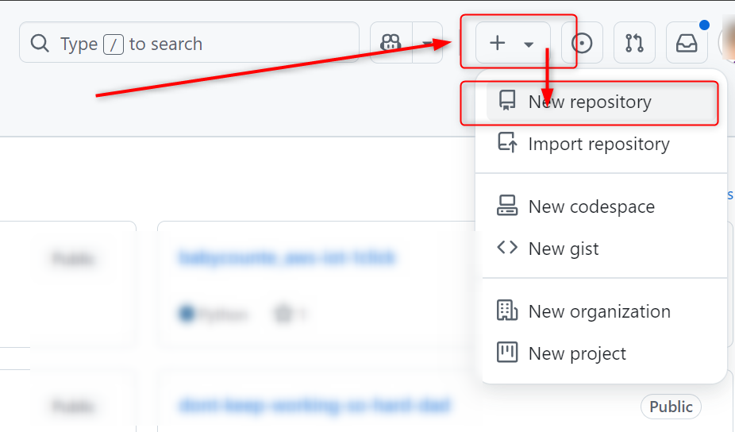
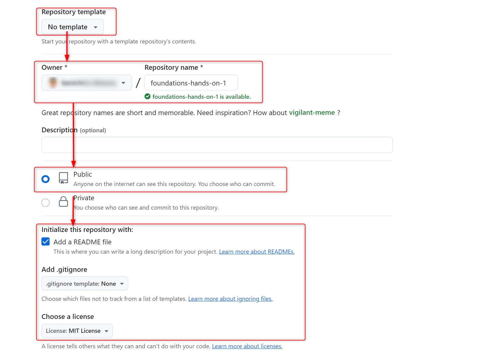
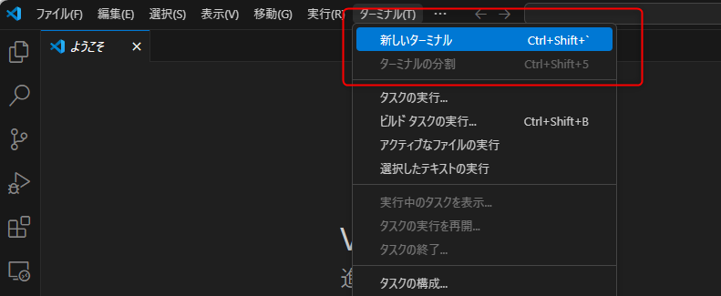
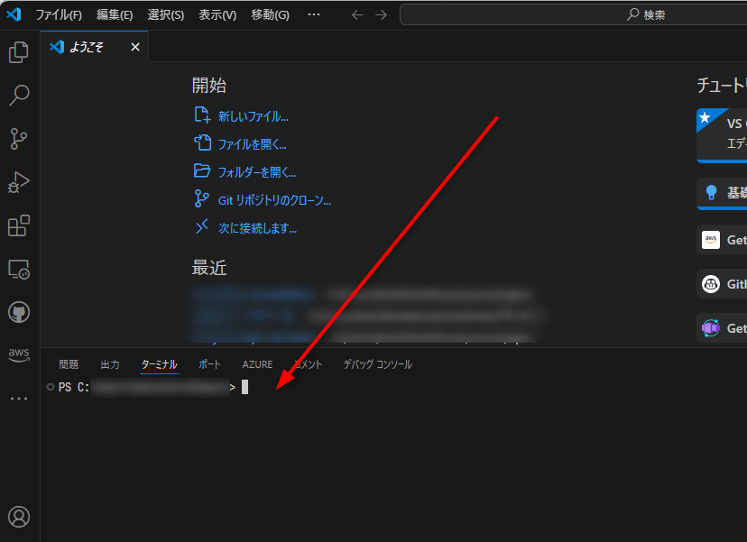
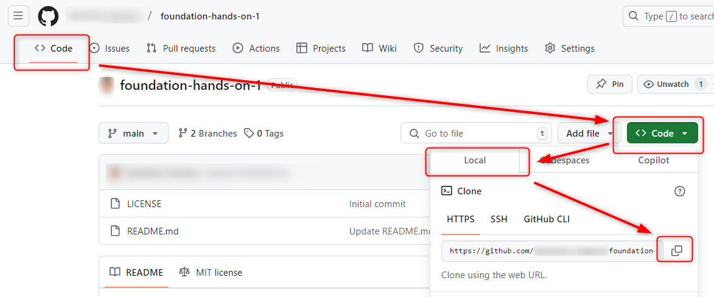
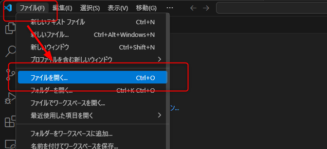
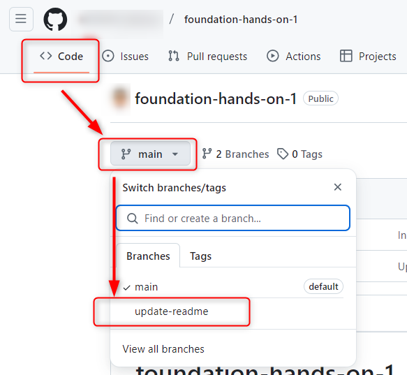
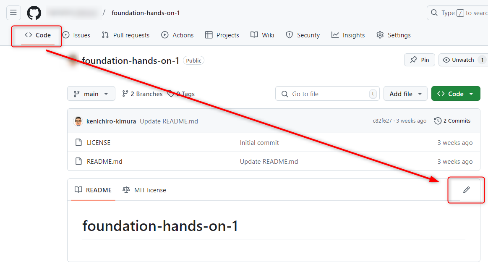
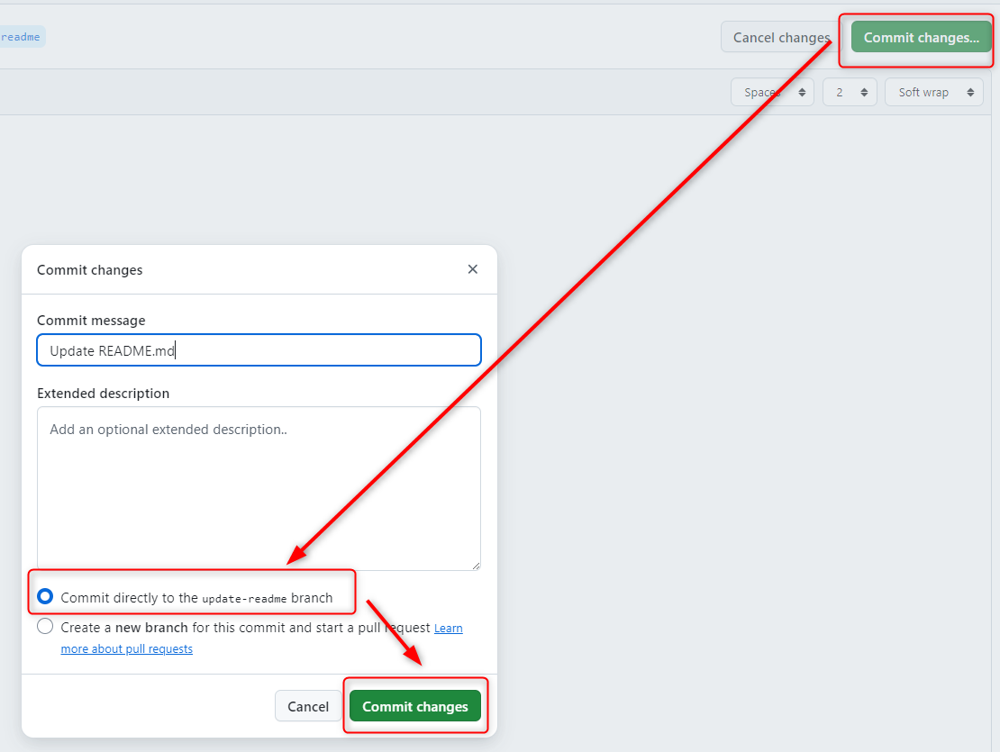

# ドメイン1:GitとGitHubの紹介

## リポジトリの作成

[github.com](https://github.com)で、自身のアカウントにパブリックなリポジトリを作成する。  
本ドキュメントを参照しながら作業できるように、ブラウザの別のタブまたは別のウインドウで開いて作業する。

- 以下のボタンを押して、新しいリポジトリの作成画面に移動する
  -   
- リポジトリの作成画面で、次の項目を設定し、リポジトリを作成する
  - 「Repository template」は「No template」を選択する
  - 「Owner」は自分のアカウントを選ぶ(選択肢がある場合)
  - 「Repository name」は`foundations-hands-on-1`と入力
  - 「Public」を選択
  - 「Initialize this repository with:」は以下のように選択する
    - 「Add a README file」にチェックを入れる
    - 「Add .gitignore」は「.gitignore template: None」を選択する
    - 「Choose a license」は「MIT License」を選択する
  - 

## リポジトリのクローンとgitの操作

自身のPCにクローンして、gitの基本操作を行ってみる。

- 事前にインストールしていたVisual Studio Codeを起動する
  - 「ターミナル」メニューから「新しいターミナル」を選択する
  - 
  - Visual Studio Codeの画面下部に、ターミナル(文字でコマンドを入力して作業を行う場所)が表示される
  - 
- ターミナルで、gitの初期設定を行う（※後述）
  - `git config --global user.name "あなたの名前"`コマンドを実行する
  - `git config --global user.email "あなたのgithubのアカウントのメールアドレス"`コマンドを実行する
    - (*)`--global`オプションをつけると、この設定があなたのPCのアカウント全体に適用される。この設定を特定のリポジトリだけに適用したい場合は、後述のクローンしたディレクトリに移動した（★）あとに、`--global`オプションを付けずに実行する。
- ブラウザで開いているgithub.comのリポジトリのページで、ナビゲーションのCodeを開き、「Code」ボタンからHTTPSのURLをコピーする
  - 
- ターミナルで`git clone 取得したURL`コマンドを実行する。このコマンドを実行すると、ターミナルで開いているディレクトリに`foundations-hands-on-1`というディレクトリが作成され、その中にリポジトリのファイルがクローンされる
- ターミナルで`cd foundations-hands-on-1`コマンドを実行し、リポジトリのディレクトリに移動する（★）
- 作業用ブランチを作成する
  - ターミナルで`git branch`コマンドを実行し、現在は`main`ブランチにいることを確認する
  - ターミナルで`git switch -c update-readme`コマンドを実行する
  - ターミナルで`git branch`コマンドを実行し、作成した`update-readme`ブランチにいることを確認する
- `README.md`を編集する
  - Visual Studio Codeのファイルメニューから「ファイルを開く」を選択し、`foundations-hands-on-1`ディレクトリにある`README.md`を開く
  - 
  - 適当な文字列を追加して、保存する
- 状態を確認する
  - ターミナルで`git status`コマンドを実行する
  - 変更されたファイルが1つあり、ステージされていないというメッセージが出るのを確認する
- 変更したファイルをステージングエリアに追加する
  - ターミナルで`git add README.md`コマンドを実行する
- 状態を確認する
  - ターミナルで`git status`コマンドを実行する
  - 変更されたファイルが1つあり、ステージされているというメッセージが出るのを確認する
- ステージングエリアのファイルをコミットする
  - ターミナルで`git commit -m "[modify] update README"`コマンドを実行する
- リモートリポジトリにプッシュする
  - ターミナルで`git push --set-upstream origin update-readme`コマンドを実行する
    - (*)手元で作成したブランチをリモートリポジトリに作成する場合、`--set-upstream`オプションを付ける必要がある
- github.comでリポジトリにアクセスし、ファイルが変更されているのを確認する
  - 一度画面をリロードする
  - ナビゲーションのCodeの、「Code」タブの下にブランチを選択できるプルダウンがあるので、ここから`update-readme`を選択する
  - 
- 画面上から`README.md`を変更する(鉛筆ボタンを押す)
  - 
  - 資料で説明されたmarkdownを色々書いてみる
  - [公式ドキュメント](https://docs.github.com/ja/enterprise-cloud@latest/get-started/writing-on-github/getting-started-with-writing-and-formatting-on-github/basic-writing-and-formatting-syntax)
  - 変更内容を直接コミットする
  - 
- 画面で変更したものをローカルのリポジトリに反映する
  - Visual Studio Codeのターミナルで`git pull`コマンドを実行する
  - `README.md`が変更されているのを確認する

※ Gitの初期設定（`git config`）についての詳細は、[Gitの初期設定](https://git-scm.com/book/ja/v2/%e4%bd%bf%e3%81%84%e5%a7%8b%e3%82%81%e3%82%8b-%e6%9c%80%e5%88%9d%e3%81%aeGit%e3%81%ae%e6%a7%8b%e6%88%90)の「個人の識別情報」をご参照ください。

## GitHub Desktop

インストール可能ならば、GitHub Desktopをインストールして動かしてみる。
  
- [GitHub Desktopのインストール方法](https://docs.github.com/ja/enterprise-cloud@latest/desktop/installing-and-authenticating-to-github-desktop/installing-github-desktop)

## GitHub Mobile

インストール可能ならば、GitHub Mobileをインストールして動かしてみる。

---
[次のドメインへ](../domain2/README.md)  
[目次へ](../README.md)
