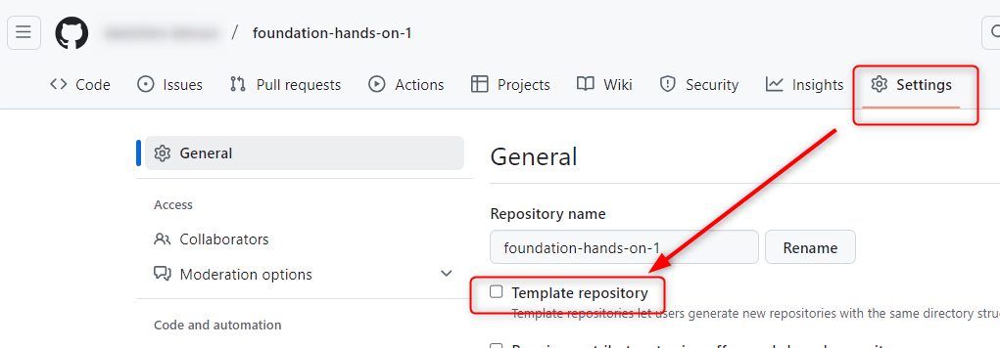
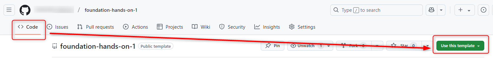
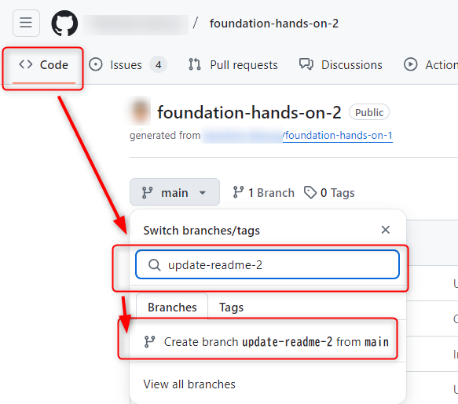
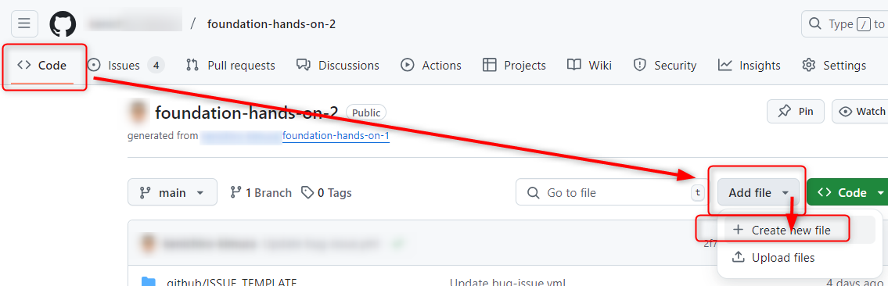
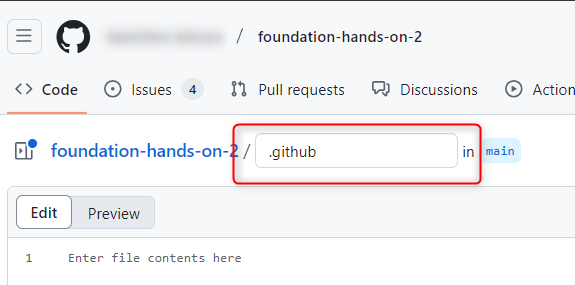
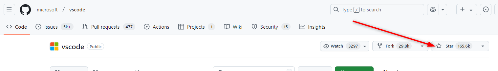

# ドメイン2:GitHubリポジトリの操作

## リポジトリのナビゲーション

リポジトリのナビゲーションを確認する。

- １. 先ほど作成した`foundations-hands-on-1`リポジトリをgithub.comで開く
- ２. ブランチの選択やファイルの一覧があり、READMEやLICENSEが表示されている事を確認する
- ３. 画面右側にリポジトリの各種メタ情報が表示されていることを確認する

## テンプレートリポジトリ

テンプレートリポジトリについて確認する。

- １. `foundations-hands-on-1`リポジトリのナビゲーションのSettingsにアクセスする
- ２. Generalの`Template repository`にチェックを入れる
  - 
- ３. ナビゲーションのCodeで、右上の「Use this template」を押して、テンプレートから`foundations-hands-on-2`という新しいパブリックリポジトリを作成する
  - 

## ブランチの作成

github.com上でのブランチの作成方法を確認する。

- １. `foundations-hands-on-2`リポジトリにgithub.comでアクセスし、ナビゲーションのCodeでブランチ選択のプルダウンを開き、「Switch branches/tags」の下の枠に`update-readme-2`と入力し、「Create branch update-readme-2 from main」を選択して`update-readme-2`ブランチを作る
  - 

## ファイルの追加

github.com上でのファイルの追加方法を確認する。

- １. ナビゲーションのCodeから「Add file」ボタンを押してファイルを作成する
  - 
    - (*)ウインドウのサイズなどによって「Add file」ボタンが「＋」ボタンになっている場合がある
  - ファイル名に`.github/README.md`と入力
  - 
  - 本文に`# foundations-hands-on-2`と入力してコミットする
  - 
- ２. ナビゲーションのCodeで、今作ったファイルがREADMEとして表示されていることを確認する
  - これによって、複数のREADMEがある場合、`.github`ディレクトリ -> rootディレクトリ -> `docs`ディレクトリの順で優先的に表示されるようになっていることが分かる
  - 時間があるならファイルを削除したり、`docs/README.md`を作成してみて、複数のREADMEがある場合の動作を詳細に確認する
  - 参考：[READMEについて](https://docs.github.com/ja/repositories/managing-your-repositorys-settings-and-features/customizing-your-repository/about-readmes)
- ３. 他のファイルについては[公式ドキュメント](https://docs.github.com/ja/enterprise-cloud@latest/repositories/managing-your-repositorys-settings-and-features/customizing-your-repository)を確認しておく

## starを付ける

Starについて確認する。

- １. [Visual Studio Codeのリポジトリ](https://github.com/microsoft/vscode)にアクセス
  - starを押してみる
  - 
- ２. [https://github.com/stars](https://github.com/stars)にアクセスしてみると、vscodeが出てくるのを確認する
- ３. Visual Studio Codeのリポジトリに戻って、[画面右のメタデータのstars](https://github.com/microsoft/vscode/stargazers)を見てみると、starを付けたアカウントが見られることを確認する

## Feature preview

github.comの任意の画面からアカウントアイコンをクリックし、メニューから「Feature preview」にアクセスしてみる。

---
[前ドメインへ](../domain1/README.md)  
[次のドメインへ](../domain3/README.md)  
[目次へ](../README.md)
