# ドメイン3:共同作業機能

## Issueの作成と操作

Issueの作成と操作について確認する。

- `foundations-hands-on-2`リポジトリにgithub.comでアクセスし、ナビゲーションのIssuesにアクセスする
- 「New issue」ボタンでIssueを作る。入力できる項目を確認する。descriptionにマークダウンが使え、ツールチップでの入力やスラッシュコマンド(`/`を入力してみる)が使えることを確認する
  - 
  - 「README.mdの更新」というtitleにする
  - 「Submit new issue」ボタンを押してIssueを作成する
- 作成したIssueの画面を見る。右側にメタデータがあることを確認し、それぞれが何を表しているかを確認する。
  - メタデータのDevelopmentから`foundations-hands-on-2`リポジトリを選択し、`update-readme`ブランチを選択し、「Apply」を押してブランチと紐付けてみる
  - 
  - ピン留めしてみる
  - 
- 2つめのIssueを作る
  - 1つめと同じ、「README.mdの更新」という内容にする
- Issueの一覧で、フィルターやソートをしてみる
- それぞれのIssueの一番下のボタンからクローズ、再オープンしてみる
  - 「Close issue」ボタンの右の「▼」でプルダウンが開き、クローズに2種類あることを確認する
  - 
  - ナビゲーションのIssuesをクリックしてIssueの一覧画面に戻り、フィルターの「is:open」を「is:closed」に変更すると、クローズしたissueの一覧が表示される。そのうちの一つにアクセスして、再度オープンしてみる
  - 
  - 
- 2つめのIssueにアクセスし、重複とするためにコメントに`Duplicate of #1`と入力して「Comment」ボタンを押す
  - マークがついたとメッセージが出ていることを確認する
  - 

> [!TIP]
> これは、以下のようなケースで使うことを講師は説明する
>
> - もし重複したIssueを見つけたとしても、多くの人にはIssueの削除の権限がない
> - 削除できないが、「解決済み」としてcloseするのは適切でない
> - そこで、クローズする前にマークしておくことで、クローズの理由を伝えることができる
> - 現在はクローズの種類として「Close as not planned」があるのでそれを併せて使う

- リポジトリをもう１つ作る
  - 名前は`foundations-hands-on-3`
    - パブリック、READMEあり、ライセンスはMIT、.gitignoreはなし
  - `foundations-hands-on-3`リポジトリでIssueを作る
    - titleは`転送のテスト`とする
    - Issueの右下の「Transfer」ボタンで、`foundations-hand-on-2`リポジトリに転送してみる
    - 
  - 転送されていることを確認する
  - 転送されてきたIssueを右下のボタンで削除してみる
  - 
- Issue templateとFormsを作ってみる
  - [公式ドキュメント](https://docs.github.com/ja/enterprise-cloud@latest/communities/using-templates-to-encourage-useful-issues-and-pull-requests/configuring-issue-templates-for-your-repository)
  - **Issue template**：Feature request のテンプレートを作る
    - `foundations-hands-on-2`リポジトリにgithub.comでアクセスし、ナビゲーションのSettingsにアクセス
    - General > Features > Issuesで「Set up templates」ボタンを押してテンプレートを作ってみる
    - 
    - `Add template: select` から `Feature request` を選ぶ
    - 
    - `Preview and edit`  ＞ `✏️` で編集画面に移動して、テンプレートを編集する
    - 
    - 
    - 
    - 作成したファイルは`.github/ISSUE_TEMPLATE/`にあることを確認する
  - **Forms**：Bug report のフォームを作る
    - Issue formsの定義は[サンプルのYAML](./bug-report.yml)をコピペして、`.github/ISSUE_TEMPLATE/bug-report.yml`を作成する
  - ナビゲーションのIssuesからIssue一覧画面に戻って「New issue」ボタンを押し、Issue templateとIssue formsを使ってIssueを作ってみる

## Pull requestの作成と操作

Pull requestの作成と操作について確認する。

- `foundations-hands-on-2`リポジトリにgithub.comでアクセスし、CODEOWNERSファイルを新規に作成する
  - ハンズオンの相方をリポジトリに招待する
    - リポジトリのナビゲーションのSettingsからCollaborators and teamsにアクセスし、「Add people」ボタンを押す
    - 
    - 相方に招待メールが届いているので、リンクをクリックして招待を受け入れてもらう
  - ハンズオンの相方をCODEOWNERSファイルでレビュアーにいれておく
  - 書式は`*    @相方のアカウント名`
  - 
- github.com上でリポジトリにアクセスし、ナビゲーションのCodeから適当なファイルを選び、設定したアカウント名がオーナーとして表示されることを確認する（マウスカーソルを乗せると表示される）
- 
- mainブランチの`README.md`を更新。`foundations-hands-on-1`という記載を`foundations-hands-on-2`に修正し、直接プッシュではなく`Create a new branch`を押す
  - Pull request画面に移動するが、本ハンズオンでは、ナビゲーションのPull requestsを押してキャンセルする
- 作成したブランチからPull requestを作る
  - ナビゲーションのPull requestsから「New Pull request」を押す
  - 
  - タイトルに`Update README.md`を入れる
  - Descriptionは適宜入力しつつ、`Close #1`を入れる(もし作成したIssueの番号がずれてるなら#の後ろの数字を変える。#を入れたら補完が効く)
  - 「Create pull request」ボタンの右の「▼」を押し、draftで作成することもできることを確認する
  - 「Create pull request」ボタンを押してPull requestを作成する
  - 作成したらCODEOWNERSに先ほど入れた、ハンズオンの相方の人が自動的にレビュアーに入ってる事を確認する
- 作成したPull requestの画面で、これらの「Conversation」「Commits」「Checks」「Files changed」タブがあることを確認する
  - 
- コメントしてみる
  - マークダウンやslash commandが使えることを確認する
- Pull requestのステータスについて確認する
  - 作った状態がOpen
  - Reviewersの所からdraftに変更できる。作業中でまだレビューを受けられる状態ではないようなときはdraftにしておく(作成時にdraftにもできる)
  - 
  - draftになったPull requestは、コメントの下の方の「Ready for review」を押してOpenに戻せる
  - 
  - コメントの下のボタンを押してClose、Reopenできる
  - 
- レビューしてみる
  - (*)自分のものにもレビューはできるが、できるだけハンズオンの相方のものをレビューしてみる
  - Files changedタブで、ファイルの変更内容の差分を確認して、指摘したい部分にマウスカーソルを持っていって表示された「＋」アイコンをクリックする
    - 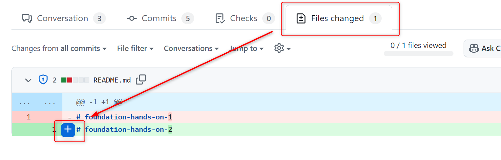
  - コメントを入力して「Start a review」を押す
    - 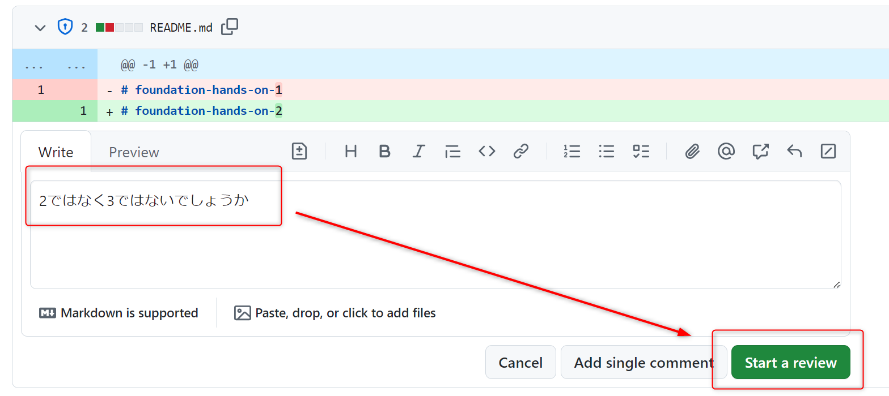
  - 「Start a review」を押すと、図のようにpending状態になるので、他のコメントを追加して複数のコメントをまとめて1つのレビューとして送ることができる
    - 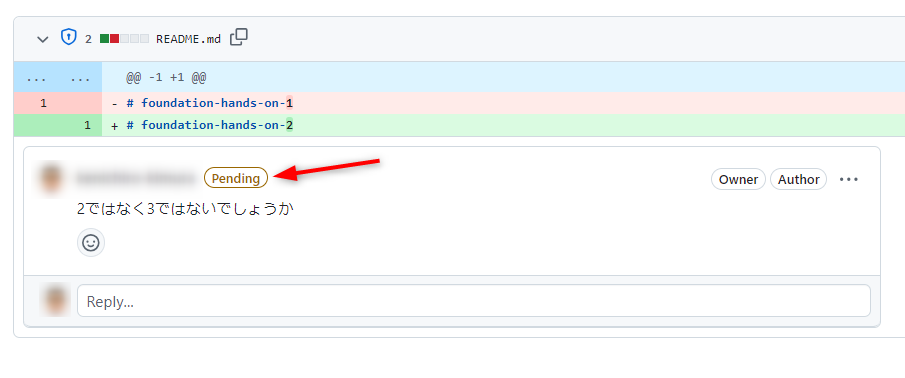
  - コメントを書き終わったら「Finish your review」を押してレビューを送る。この時にレビューのコメントを入力し、状態として「Comment」「Approve」「Request changes」のいずれかを選ぶことができる(自分自身へのレビューの場合は「Comment」しか選択できない)ので、状態を選択して「Submit review」を押す
    - 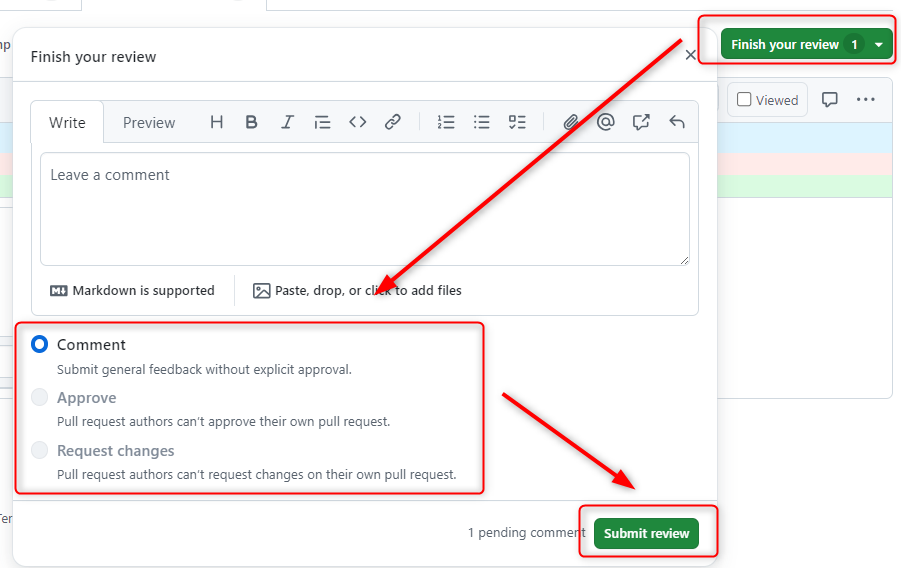
- レビューを確認し、対応する
  - Conversationタブでレビュー内容を確認して、修正を行う(修正内容をコミットし、プッシュする)
  - レビューに返信する
  - レビュアーはコメントを確認して、問題なければ「Resolve conversation」を押して解決済みにする
  - 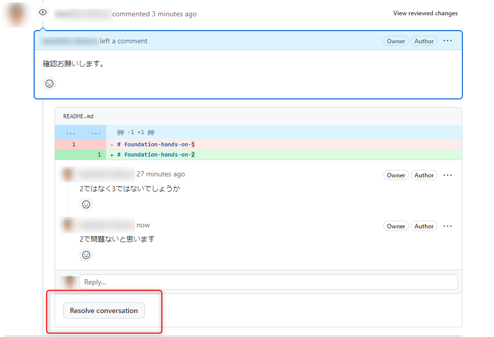
- レビューで変更提案を出す
  - ツールチップを利用するか、[suggestionコードブロック](./suggestion.md)を直接入力する
  - 
  - 「Add single comment」か「Start a review」ボタンを選択する。「Add single comment」ボタンを押すと即座に提案が送られるが、「Start a review」を押すと以下のようにpending状態になるので、「Finish your review」を押して提案を送る。
    - 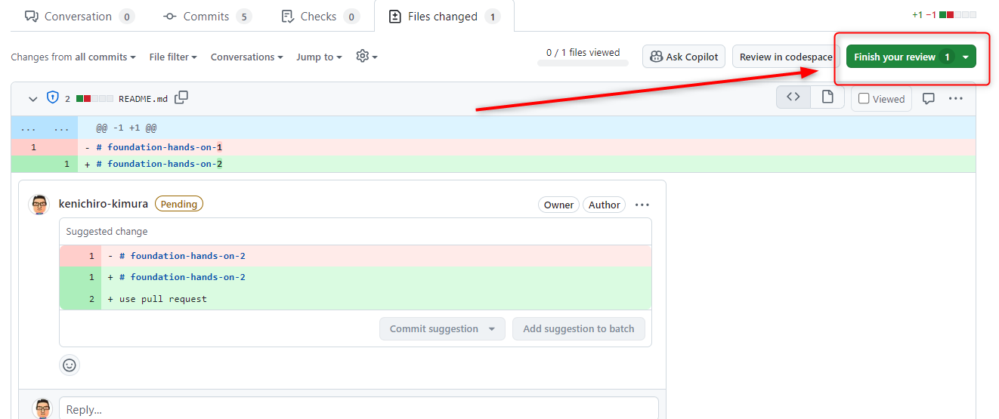
  - 提案を取り入れると即座に内容がコミットされることを確認する
    - 
- Pull requestのメタデータの「Development」からIssue #2を追加でリンクしてみる
  - 
- Pull requestをApproveし、マージする
  - レビュアーは自分がコメントしたものが全て解決され、修正内容が問題ないと判断したらApproveする
  - Files changedタブの「Review changes」から「Approve」を選択して「Submit review」を押す
    - 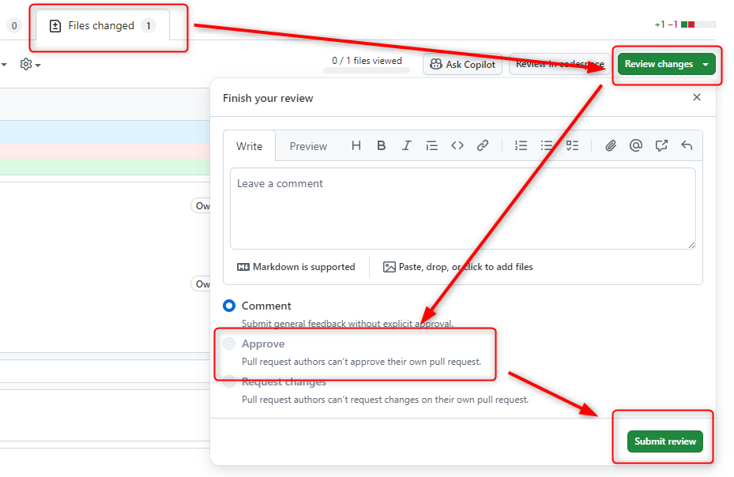
  - 全てのレビュアーがApproveしたら、Conversationタブの下の方の「Merge pull request」を押してマージする
    - 
    - 続けて「Confirm merge」を押してマージを完了する
- マージしたらPull requestがクローズされてIssueの#1/#2もクローズされることを確認する
  - マージでクローズしたPull requestは再オープンができないことを確認する
- Pull requestテンプレートを作って、テンプレートを使ったpull requestを作ってみる
  - `.github/pull_request_template.md`を作成する
  - [サンプルテンプレート](./pull_request_template.md)を貼り付けてコミットする
  - 再度READMEを更新してpull requestを作成し、Descriptionにテンプレートの内容が含まれていることを確認する

## Discussions

Discussionsについて確認する。

- `foundations-hands-on-2`リポジトリのナビゲーションのSettingsからDiscussionsを有効化する
  - 
  - 
- ナビゲーションにDiscussionsが表示されることを確認する
  - 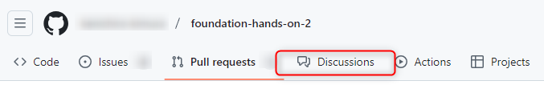
- Discussionsにアクセスする
- カテゴリがあることを確認する
- カテゴリ「Q&A」でスレッド(Discussion)を作る
  - 「New discussion」ボタンを押す
    - 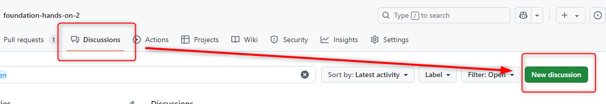
  - 「Select a discussion category」画面で「Q&A」の「Get started」を押す
    - 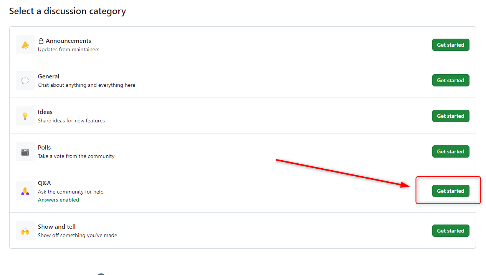
  - TitleとBodyを入力して「Start discussion」を押す
    - 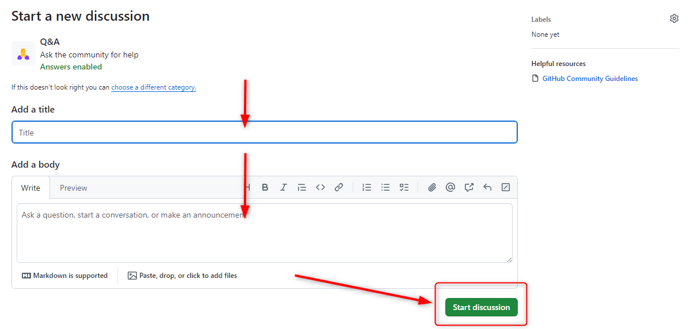
  - 回答を書き込んでみる
    - ナビゲーションのDiscussionsからDiscussionの一覧に遷移し、先ほど作成したDiscussionにアクセスする
    - 回答を書き込み、「Comment」ボタンを押す
      - 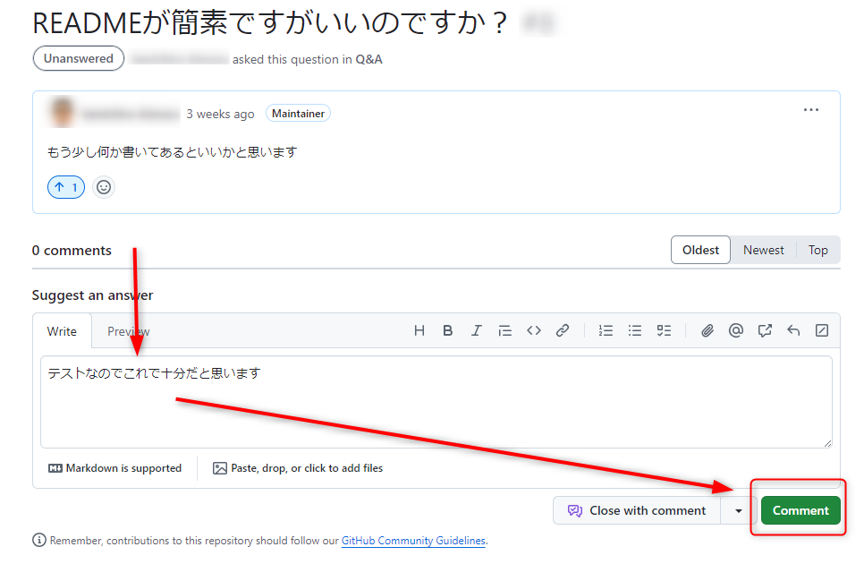
  - 回答とマークしてみる
    - このQ&Aの回答として採用したいコメントの「Mark as answer」を押す
      - 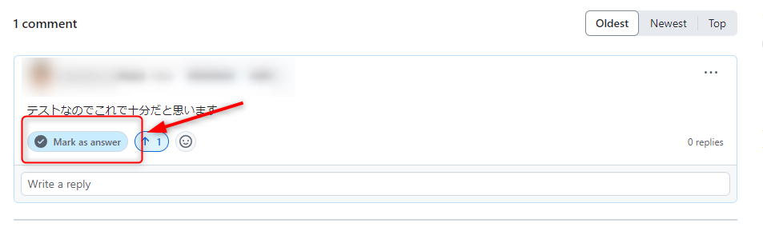
    - マークされたコメントが回答として表示されることを確認する
      - 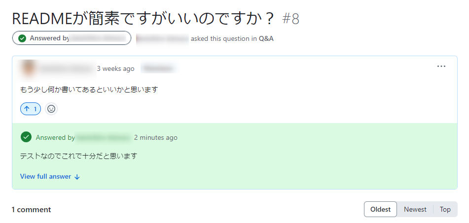
  - ピン留めしてみる
    - 「Pin discussion」と「Pin discussion to Q&A」の2つがあることを確認する
      - 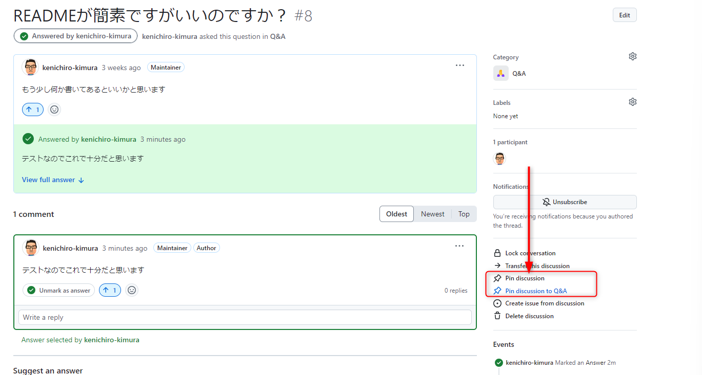
    - 「Pin discussion」を押すと背景を選ぶ画面になるので、選択して「Pin discussion」を押してピン留めする
      - 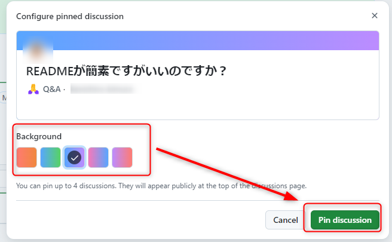
    - ナビゲーションのDiscussionsからDiscussionの一覧に遷移し、ピン留めされたDiscussionが一番上に表示されることを確認する
      - 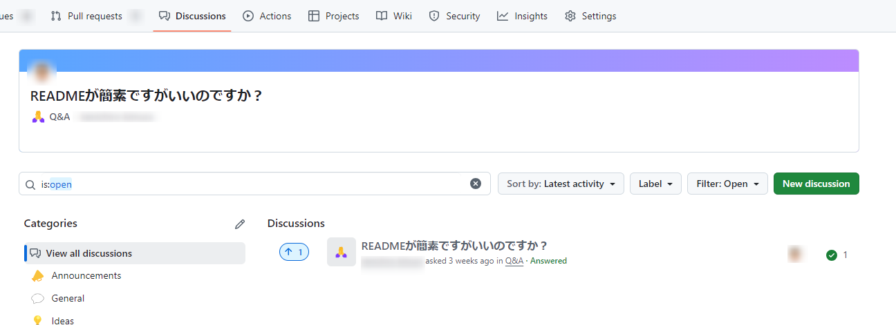
    - 再度Discussionを開いて、「Unpin discussion」を押してピン留めを解除する
      - 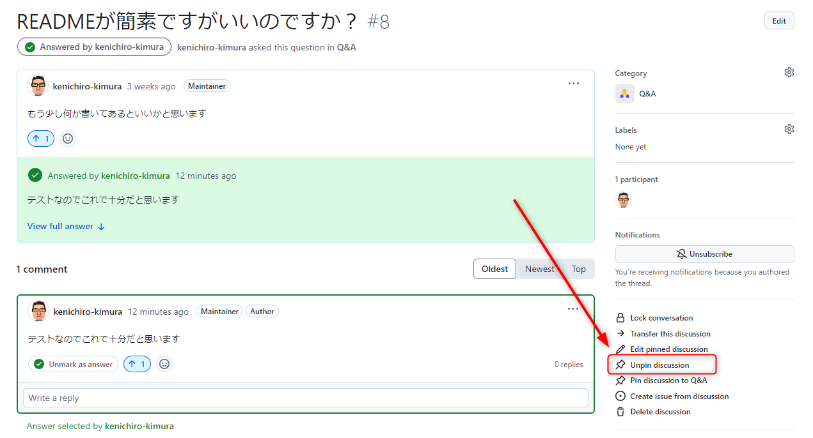
    - ナビゲーションのDiscussionsからDiscussionの一覧に遷移し、ピン留めが解除されているを確認する
    - 再度Discussionを開いて、「Pin discussion to Q&A」を押してピン留めする
      - 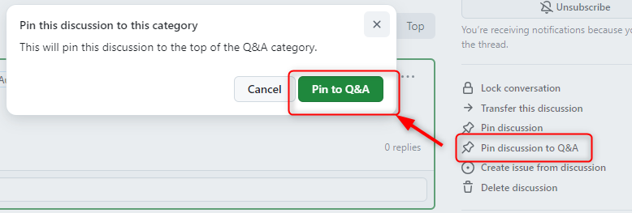
    - ナビゲーションのDiscussionsからDiscussionの一覧に遷移し、一覧表示ではピン留めされていないことを確認する
    - 「Categories」で「Q&A」を選択する。Q&Aカテゴリの一覧で、「Pinned to Q&A」と表示されているのを確認する
      - 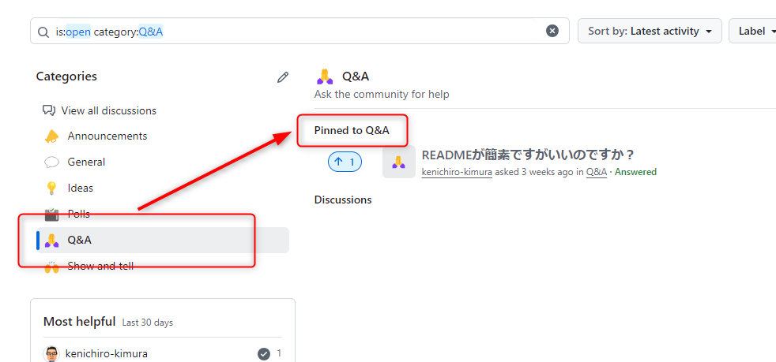
  - 時間に余裕があれば複数の「Q&A」カテゴリのDiscussionを作成してみて、ピン留めされたものが一番上に来ることを確認する
    - カテゴリを選んだ状態で「New discussion」を押してDiscussionを作成すると、そのカテゴリに属するDiscussionが作成される(先ほどのカテゴリ選択画面が表示されない)ことを確認する
    - 新しいDiscussionを作成した後、ナビゲーションのDiscussionsを押し、CategoriesからQ&Aを選択して「Q&A」カテゴリの一覧を表示すると、以下のようにカテゴリにピン留めされたものが一番上に来ていることが分かる
      - 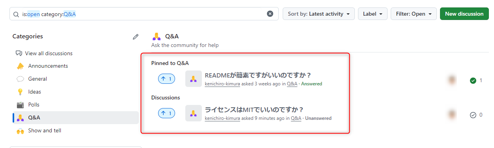
  - DiscussionからIssueを作成してみる
    - Discussionに移動し、「Create issue from discussion」を押す
    - 

## 通知

通知について確認する。

- github.comの任意のページから、画面右上のファイルボックスのアイコンを押して通知画面を開き、届いている通知一覧を見る
  - 開くとInboxの一覧が表示される
  - 
- 自身のsubscribe状態を確認・変更する
  - 通知画面の左下にある「Manage notifications」を押し、「Subscriptions」を選択する
    - 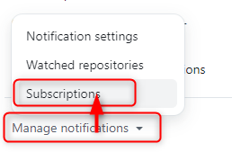
  - これまでに作成したIssueやPull request、DiscussionにSubscribeしていることを確認する
    - 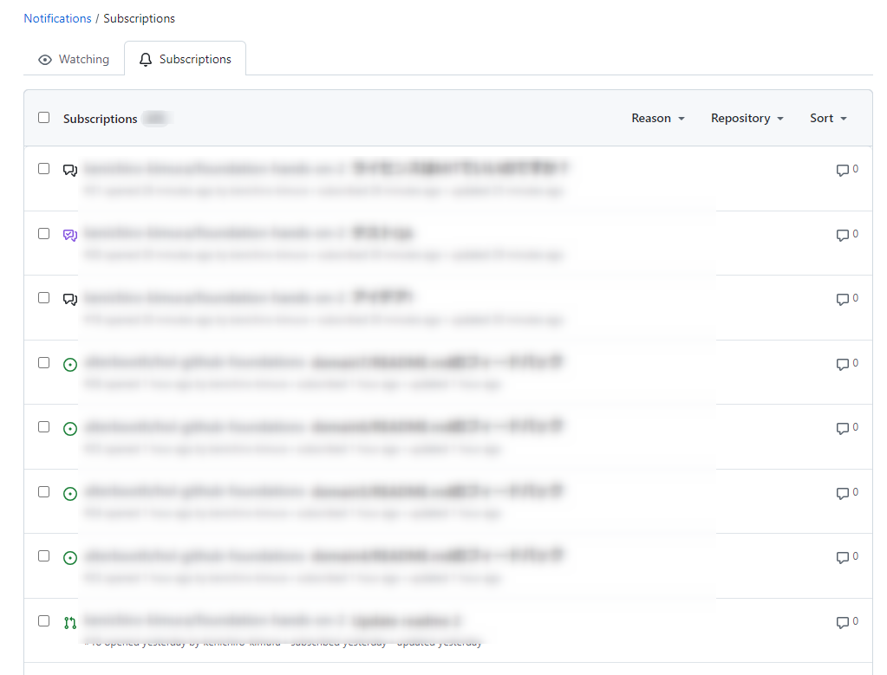
  - Subscriptionの一覧からIssueを選び、クリックして遷移する。Issueは一覧のうち、以下のアイコンのもの
    - 
  - 画面右に表示されるメタデータの「Notifications」を見て、ボタンが「Unsubscribe」になっており、その下の「Participants」に自分自身のアイコンが表示されていることを確認する
    - 
  - Unsubscribeボタンを押してみる
  - Subscriptionの一覧に戻り、該当のIssueが一覧に無いことを確認する
- `foundations-hands-on-2`のナビゲーションのCodeに移動し、「Watch」ボタンで何が選べるかを確認する
  - 
- github.comの任意のページで、右上のアカウントアイコンをクリックする
  - 
  - 「Settings」を押す
    - 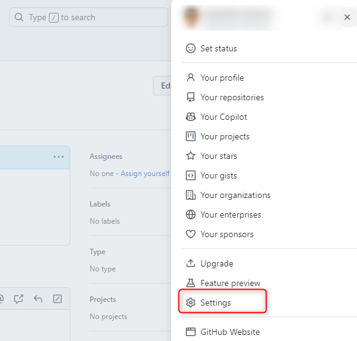
  - Notificationsを選択する
    - 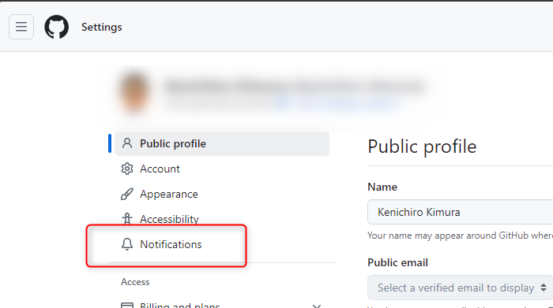
  - 通知の設定にどのようなものがあるかを確認する

## Gistについて

Gistについて確認する。

- github.comの任意のページからアカウントアイコンを押す
  - 
  - 「Your Gists」を押す
    - 
- 右上の「＋」ボタンを押して新しいGistを作る
  - 「Filename including extension」に`foundations-hands-on-1.md`と入力
  - ファイルの内容を書く
  - 「Create secret gist」ボタンを押す
  - 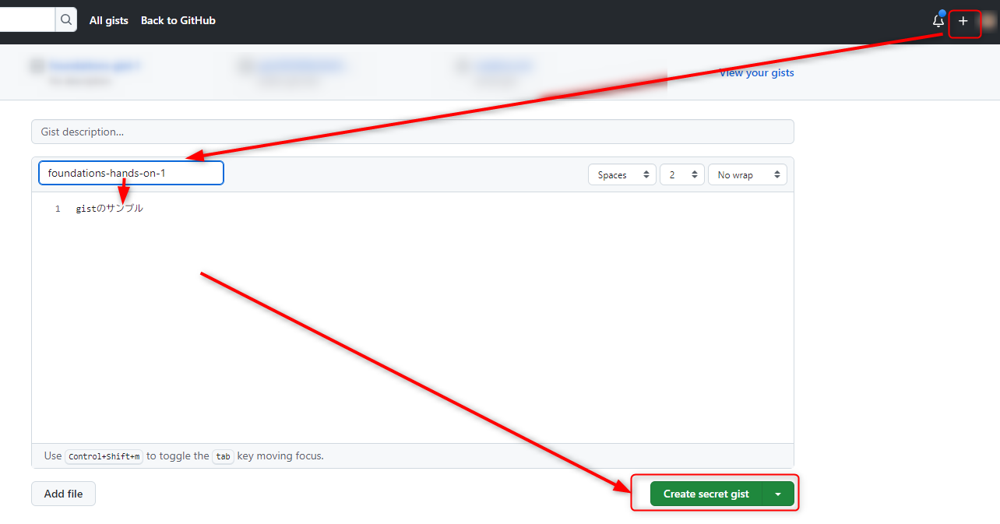
- gistをPublicにしてみる
  - 対象のgistを開いた状態で、右上の「Edit」ボタンを押す
    - 
  - 右上の「Make public」ボタンを押す
    - 
    - 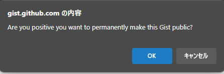
  - Publicになったgistの右上の「Edit」ボタンを押す
  - Secretに切り替えるボタンがないことを確認する
- fork/cloneのやり方を確認する
  - 対象のgistを開いた状態で、右上の「Embed」のプルダウンから「Clone via HTTPS」を押して、クローンする
    - 
  - 自身のものはforkできないので、[rxaviers/gist:7360908](https://gist.github.com/rxaviers/7360908)にアクセスする
    - 右上のForkを押す
      - 
    - 自身のgistにforkされたことを確認する
      - 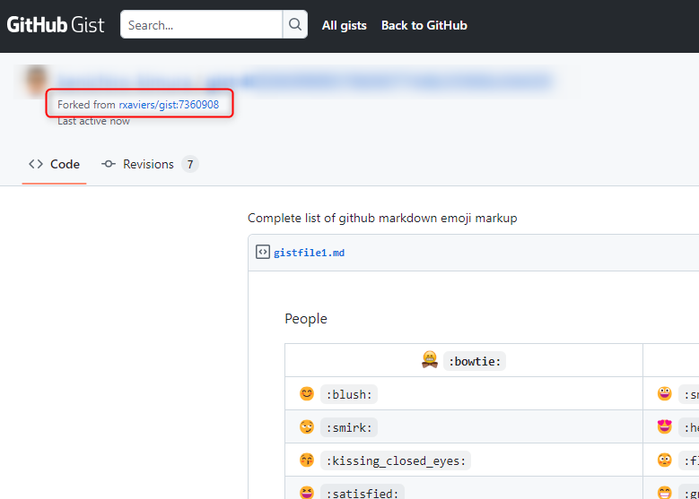

## Wikiについて

Wikiについて確認する。

- `foundations-hands-on-2`リポジトリのナビゲーションのWikiからWikiにアクセスして、読み書きしてみる
  - 「Create the first page」を押す
    - 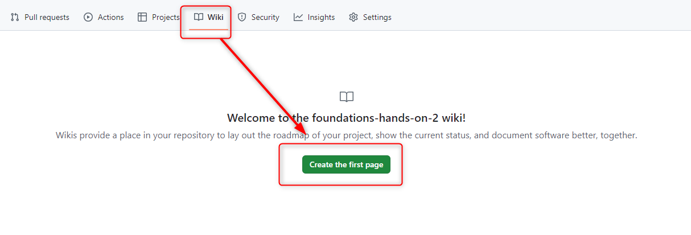
  - Title(デフォルトで「Home」と入っている)とページの本文(デフォルトで「Welcome to the foundations-hands-on-2 wiki!」と入っている)を編集する。「Edit message」はWikiのページを作成・編集したときに履歴に残す説明メッセージなので適宜入力する。
  - 「Save page」ボタンを押してページを保存する
    - 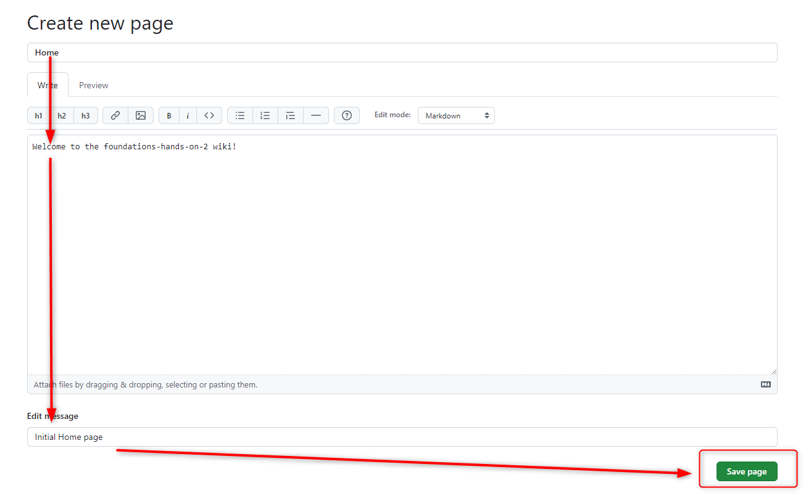
  - 「New page」を押して新しいページを作成する
    - 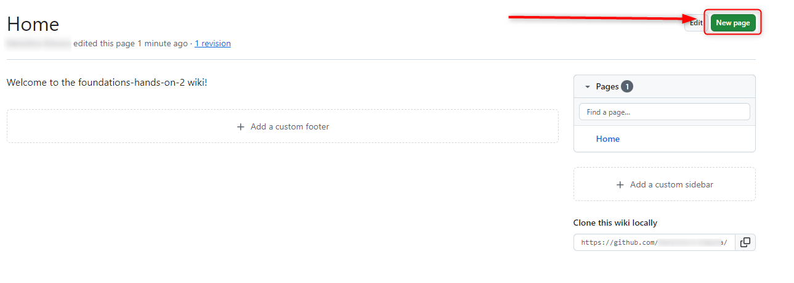
  - 新しいページを作成すると、ページの一覧に追加されていることを確認する
    - 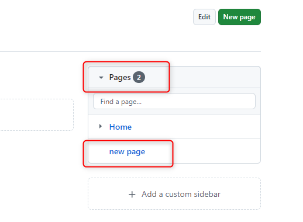
  - 「Add a custom sidebar」を押す
    - 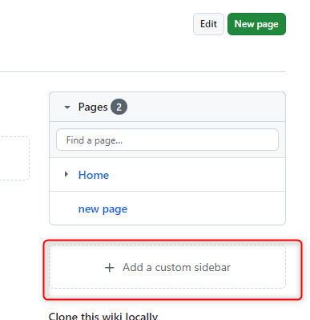
  - Titleはデフォルトで入っている「_Sidebar」のままにして本文とEdit message(オプション)を入力して「Save page」を押す
    - 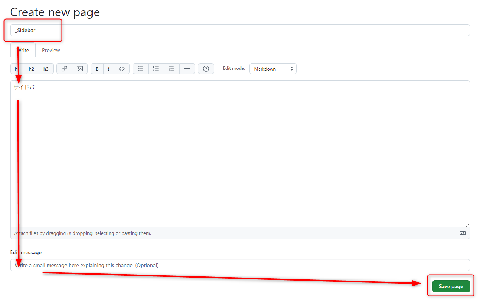
  - Pagesの下にsidebarが表示されていることを確認する
    - 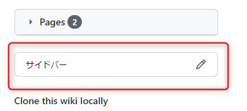
- ナビゲーションのSettings > FeaturesでWikiの権限を見てみる
  - 「Restrict editing to collaborators only」がチェックされていると、collaboratorのみが編集できる。GitHubアカウントを持つユーザーならだれでも編集できるようにするにはチェックを外す
    - 
- ナビゲーションのSettings > Featuresから、Wikiを無効化してみる
  - 「Wikis」のチェックを外すと、ナビゲーションからWikiが消えていることを確認する

## Pagesについて

GitHub Pagesについて確認する。

- `foundations-hands-on-2`リポジトリのナビゲーションのSettingsからPagesを構成する  
  - Sourceに「Deploy from branch」を選び、Branchで`main`を選択し、ディレクトリとして「/(root)」が選択されていることを確認し、「Save」ボタンを押して保存する
  - 
- しばらくしてこのGitHub Pagesの設定ページをリロードすると、公開されたPagesのURLが表示されるので、URLのリンクまたは「Visit site」ボタンからアクセスする。`README.md`ファイルが静的サイトとして展開されていることを確認する
  - 
- この`foundations-hands-on-2`リポジトリに新しく`index.html`という名前のファイルを作成する
  - 以下の内容を貼り付けてファイルを新規に作成する

    ```html
    <!DOCTYPE html>
    <html lang="ja">
    <head>
      <meta charset="UTF-8">
      <title>Hello World</title>
    </head>
    <body>
      <h1>Hello world</h1>
    </body>
    </html>
    ```

  - ファイルを追加後、しばらくして再度PagesのURLにアクセスして、作成した`index.html`の内容が展開されていることを確認する
- もう一つのデプロイ方法を確認するため、Settings > PagesのSourceのプルダウンを開き、「GitHub Action」の選択肢があることを確認する

---

[前ドメインへ](../domain2/README.md)  
[次のドメインへ](../domain4/README.md)  
[目次へ](../README.md)
