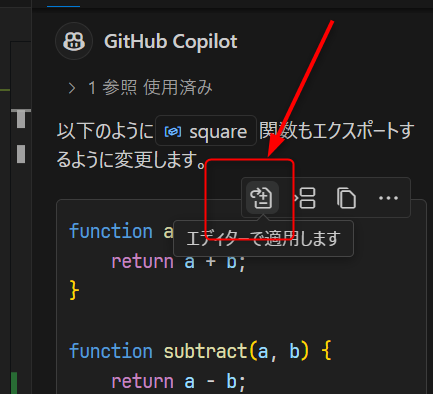
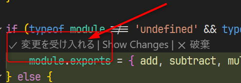

# ドメイン4:モダンな開発

## GitHub Actions

GitHub Actionsについて確認する。

- [サンプルのテンプレートリポジトリ](https://github.com/alterbooth/hol-javascript-calculator)から、自身のアカウントの下に`hol-javascript-calculator`リポジトリをPublicで作る
  - サンプルの内容は、簡単なHTMLとJavaScriptで作られた電卓アプリ

Actionsのワークフローをテンプレートから作成できることを確認する。

- ナビゲーションのActionsにアクセスし、「set up a workflow yourself」リンクを選択する
  
- 今回は空のワークフローを作成する。ファイル名は`ci.yml`とする（ディレクトリは`hol-javascript-calculator/.github/workflows`のままでよい）。
- [サンプルのYAML](./ci.yml)の内容を貼り付けて、「Commit changes...」ボタンから`main`ブランチにコミットする

このサンプルではコミットするとActionsのワークフローが実行されるので、ログを確認する。

- ナビゲーションのActionsからActionsの実行一覧を開き、実行されたワークフローのログを確認する

時間があればテストが失敗するようにコードを変更してみる。

このサンプルではトリガーに`workflow_dispatch`が指定されているので、ワークフローを手動で実行できることを確認する。

- ナビゲーションのActionsからActionsの実行一覧を開き、ワークフローの「CI」を選択する。「Run workflow」プルダウンから、「Run workflow」ボタンを選択し、ワークフローを手動で実行する。
  
  - 実行するブランチは「main」のままとする

## GitHub Copilot

GitHub Copilotについて確認する。参加者はライセンスを所有しているならばそれを使い、そうでない場合はフリープランを利用する。

- VSCodeに以下の拡張機能をインストールする
  - [GitHub Copilot](https://marketplace.visualstudio.com/items?itemName=GitHub.copilot)
  - [GitHub Copilot Chat](https://marketplace.visualstudio.com/items?itemName=GitHub.copilot-chat)
  - githubへのサインインを求められたらサインインをする
- `hol-javascript-calculator`リポジトリの`src/app.js`を開いた状態でCopilot Chatを開く
  - 「このファイルに書かれているコードの説明をして」と入力してみる
  - `src/app.js`の19行目(`function divide()`の定義の後ろ)にカーソルを持っていき、`function square(a){(改行)`と入力してみる
    - Copilotが二乗を計算する関数を提案してくれることを確認し、TABキーで確定する
  - Copilot Chatに「square関数もエクスポートして」と入力してみる
    - 提案内容を確認し、問題なければ「エディッターで適用」をクリック
    - 
    - エディッタに適用された提案内容を確認し、「変更を受け入れる」をクリックして受け入れる
    - 

## GitHub Codespaces

GitHub Codespacesについて確認する。各個人がPublicに作成したリポジトリ上であれば無料枠内で利用できるが、アカウントの制限でプライベートリポジトリしか作れない等でCodespacesを利用できない場合は講師のデモを見る。

- `hol-javascript-calculator`リポジトリのナビゲーションのCodeで、「Code」ボタンのプルダウンからCodespacesで開いてみる
  - 
  - VSCodeの画面がブラウザで開き、ファイルが修正出来ることを確認する
  - ターミナルにアクセスして、`npm install`を実行してみる
- ブラウザのタブを閉じ、同じくCodeタブにアクセスすると先ほど作ったCodespaceが一覧に表示され、そこに再接続してみると元の状態に接続できていることを確認する
- [https://github.com/codespaces](https://github.com/codespaces)にアクセスし、起動しているCodespaceを確認する
  - 停止してみる
    - 
    - 停止から再度アクセスすると、ターミナルの履歴が消えていることを確認する
  - 削除してみる 
  - 無料枠を超えると課金が発生するため、不要なCodespaceは**必ず削除する**
- github.com上でキーボードの「.」(ドット)を押して、github.devを開いてみる
  - Codespacesと違い、ターミナルを開いたり、複数のファイルを保存して1つのコミットにまとめることはできないことを確認する
- github.comでリポジトリを開いている状態で、ドメインの`github.com`を`github1s.com`に変更してアクセスしてみる
  - これはオープンソースのプロジェクトで、github.devエディッタと異なり、読み込み専用であることを確認する
  - 現在は公式の機能でgithub.devエディッタがあるので、積極的にこれを使う必要はない

---
[前ドメインへ](../domain3/README.md)  
[次のドメインへ](../domain5/README.md)  
[目次へ](../README.md)
