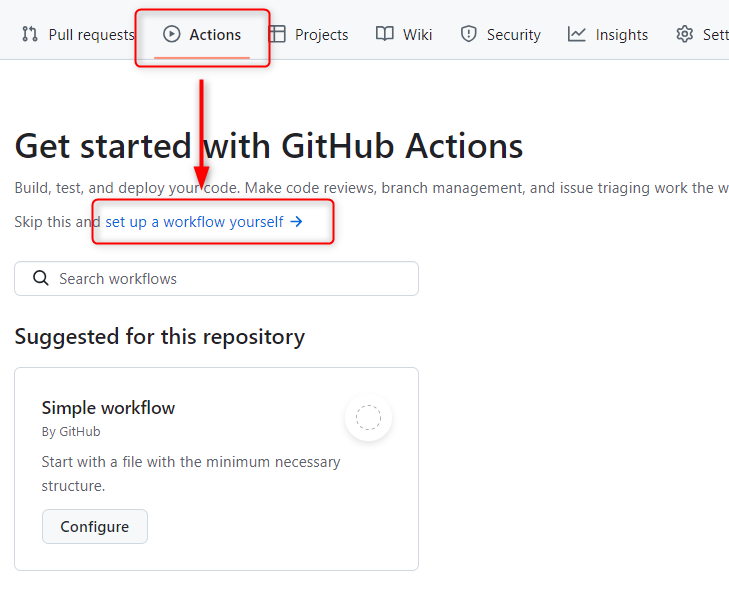
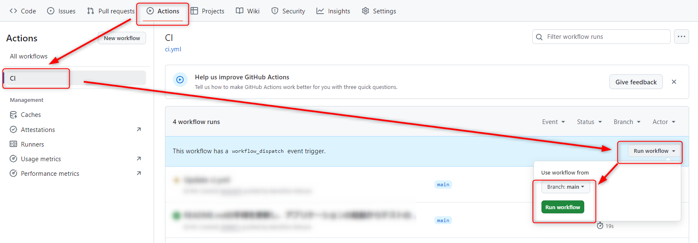
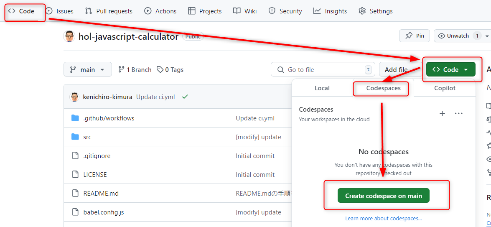
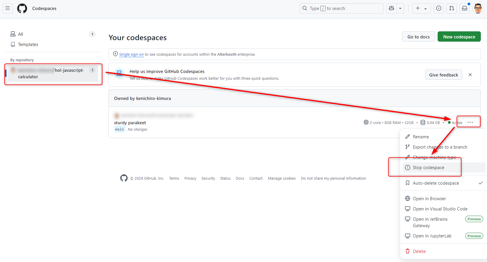

# ドメイン4:モダンな開発

## GitHub Actions

GitHub Actionsについて確認する。

- [サンプルのテンプレートリポジトリ](https://github.com/alterbooth/hol-javascript-calculator)から、自身のアカウントの下に`hol-javascript-calculator`リポジトリをパブリックで作る
  - 内容は簡単なHTMLとJavaScriptで作られた電卓アプリ
- ナビゲーションのActionsにアクセスし、テンプレートから作成できることを確認する
  - 「set up a workflow yourself」で今回は空のワークフローを作成する。ファイル名は`ci`とする
  - 
  - [サンプルのYAML](./ci.yml)の内容を貼り付けて保存する
- プッシュするとAcitonsが動くので、ナビゲーションのActionsからログを確認する
  - 時間があればテストが失敗するようにコードを変更してみる
- イベントに`workflow_dispatch`があるので、ナビゲーションのAcitonsからワークフローを手動で起動できることを確認する
  - 

## GitHub Copilot

GitHub Copilotについて確認する。Copilotのライセンスがない参加者のために、基本的には講師がデモを行う

- 講師がこのリポジトリのコードに対してCopilotの動作をみせるので、Copilotがどのように動くものかを確認する
  - もしCopilotのライセンスを持っているのであれば、同じようにChatでコードについて説明を求めたりしてみる

## GitHub Codespaces

GitHub Codespacesについて確認する。各個人がPublicに作成したリポジトリ上であれば無料枠内で利用できるが、アカウントの制限でプライベートリポジトリしか作れない等でCodespacesを利用できない場合は講師のデモを見る。

- `hol-javascript-calculator`リポジトリのナビゲーションのCodeで、「Code」ボタンのプルダウンからCodespacesで開いてみる
  - 
  - VSCodeの画面がブラウザで開き、ファイルが修正出来ることを確認する
  - ターミナルにアクセスして、`npm install`を実行してみる
- ブラウザのタブを閉じ、同じくCodeタブにアクセスすると先ほど作ったCodespaceが一覧に表示され、そこに再接続してみると元の状態に接続できていることを確認する
- [https://github.com/codespaces](https://github.com/codespaces)にアクセスし、起動しているCodespaceを確認する
  - 停止してみる
    - 
    - 停止から再度アクセスすると、ターミナルの履歴が消えていることを確認する
  - 削除してみる 
  - 無料枠を超えると課金が発生するため、不要なCodespaceは**必ず削除する**
- github.com上でキーボードの「.」(ドット)を押して、github.devを開いてみる
  - Codespacesと違い、ターミナルを開いたり、複数のファイルを保存して1つのコミットにまとめることはできないことを確認する
- github.comでリポジトリを開いている状態で、ドメインの`github.com`を`github1s.com`に変更してアクセスしてみる
  - これはオープンソースのプロジェクトで、github.devエディッタと異なり、読み込み専用であることを確認する
  - 現在は公式の機能でgithub.devエディッタがあるので、積極的にこれを使う必要はない

---
[前ドメインへ](../domain3/README.md)  
[次のドメインへ](../domain5/README.md)  
[目次へ](../README.md)
