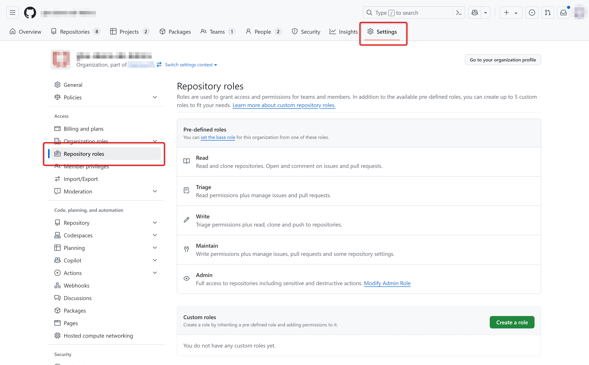
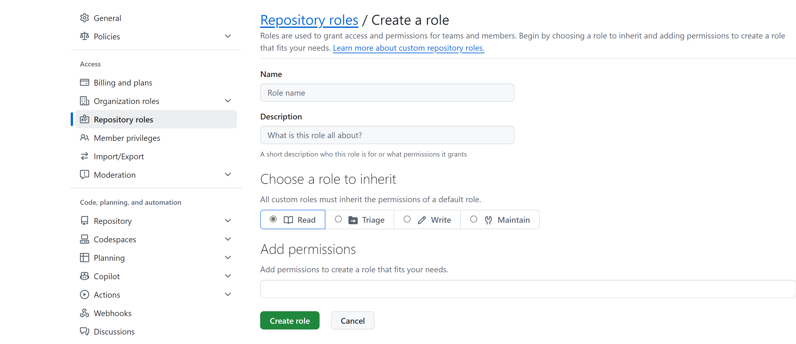
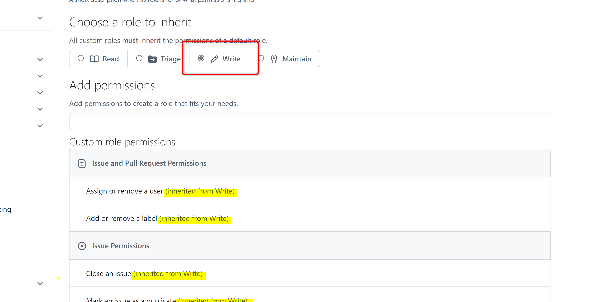
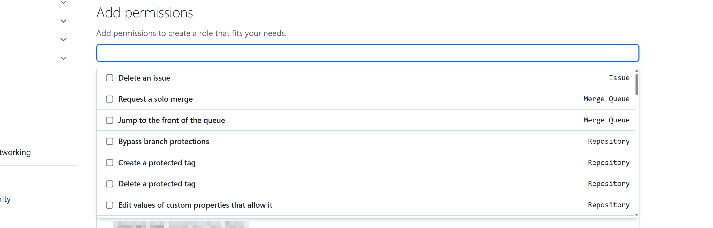
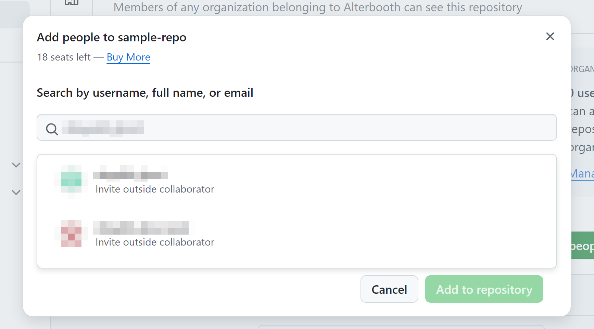
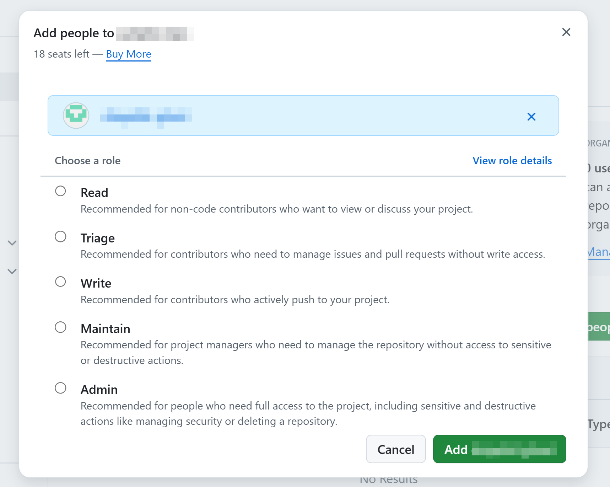

# ドメイン6:プライバシー、セキュリティ、および管理

## 2FAの設定画面

2要素認証について確認する。

- github.comの任意の画面で右上のアカウントアイコンをクリックし、`Settings` > `Access` > `Password and authentication`を開く
- 「Two-factor authentication」の各項目を確認する
  - 「Preferred 2FA method」
  - 「Two-factor methods」
  - 「Recovery options」

## Repositoryのロールについて

Repositoryのロールを確認する（Organizationの機能のため、講師によるデモ）。

- OrganizationのSettingsで「Repository roles」を開く  
  
- 「Pre-defined roles」で定義済みのロールを確認する
- 「Custom roles」で「Create a role」ボタンを選択し、新しいロールを作成する  
  
  - 「Choose a role to inherit」で「Write」を選択し、継承するパーミッションを確認する  
    
  - 「Add permissions」のフィールドにカーソルを置き、追加できるパーミッションを確認する  
    

## リポジトリの設定

リポジトリの設定とSecurity,Insightsについて確認する。

- `hol-javascript-calculator`リポジトリのナビゲーションのSettingsを見ていく
- 同じリポジトリのナビゲーションのSecurityとInsightsをみる

## Organization/Enterpriseの設定

Organizationの設定のうち、Outside collaboratorsについて確認する（講師によるデモ）。

- Organization配下のリポジトリで、`Settings` > `Access` > `Collaborators and teams`を開く
- 「Add people」ボタンを選択し、追加するユーザーをアカウント名で検索し、選択する  
  
  - （メールアドレスでも入力できるが、該当するユーザーの検索は行われない）
- 招待するユーザーに割り当てるロールを選択する  
  
- ⚠️招待してしまうとシートが消費されてしまうので、ハンズオンでは**招待しない**

OrganizationとEnterpriseの設定を確認する（講師によるデモ）。

- 講師はOrganizationとEnterpriseの設定画面を示す
- OrganizationでTeamを作ってみせる
  - Teamは階層を作れることを示す
  - リポジトリの設定から、「Collaborators and teams」で、Teamに対してロールを指定して招待できることを示す

---
 [前ドメインへ](../domain5/README.md)  
[次のドメインへ](../domain7/README.md)  
[目次へ](../README.md)
